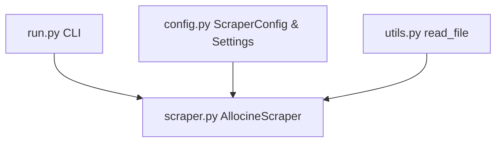

# 🤖 AlloCine Dataset Scraper - Developer & AI Agent Guide

Welcome! This guide provides all the necessary architectural context, workflow instructions, coding standards, and common gotchas for both AI agents and human developers working on this repository.

> [!NOTE]
> This repository is a clean, modern, type-safe Python scraper designed to gather movie metadata from the French cinema website `Allocine.fr`. It uses `uv` for package management, `pydantic` for configuration, and `pytest` for unit testing.

---

## 🗺️ Architectural Overview

The project is structured as a standard Python package under the `src/allocine_dataset_scraper` directory:



### Module Breakdown:
- [src/allocine_dataset_scraper/config.py](file:///Users/oliviermaillot/Projects/Github/allocine-dataset-scraper/src/allocine_dataset_scraper/config.py): Configuration management. 
  - `ScraperConfig`: Pydantic model for CLI/API execution settings (e.g., number of pages, directories, wait times).
  - `Settings`: Pydantic `BaseSettings` for global scraper options (e.g., Base URL, User-Agent, request timeouts) loaded from environment variables (prefixed with `ALLOCINE_`) or `.env` files.
- [src/allocine_dataset_scraper/scraper.py](file:///Users/oliviermaillot/Projects/Github/allocine-dataset-scraper/src/allocine_dataset_scraper/scraper.py): Core scraping logic. Contains the `AllocineScraper` class, pagination loop, movie page extraction methods, rate limiting, and output CSV writing.
- [src/allocine_dataset_scraper/run.py](file:///Users/oliviermaillot/Projects/Github/allocine-dataset-scraper/src/allocine_dataset_scraper/run.py): CLI interface built with `click`. Defines options corresponding to `ScraperConfig` fields and invokes the scraper.
- [src/allocine_dataset_scraper/utils.py](file:///Users/oliviermaillot/Projects/Github/allocine-dataset-scraper/src/allocine_dataset_scraper/utils.py): Generic utility functions (e.g., UTF-8 file readers).

---

## ⚙️ Development Setup & Quality Workflow

This project leverages `uv` for fast and reliable dependency management.

### Setup Environment
```bash
# Sync all dependencies and setup the virtual environment (.venv)
uv sync --all-extras --dev
```

### Quality Assurance Checks
Before committing any changes, ensure all verification tools pass:

| Tool | Purpose | Command |
| --- | --- | --- |
| **pytest** | Run all unit & integration tests with coverage | `uv run pytest --cov` |
| **ruff check** | Code linting and style enforcement | `uv run ruff check .` |
| **ruff format** | Check code formatting | `uv run ruff format .` |
| **pyright** | Static type checking | `uv run pyright` |

> [!IMPORTANT]
> The target test coverage for the repository is **above 90%**. When modifying parsing or configuration code, you must add corresponding unit tests in `tests/test_scraper.py` or `tests/test_run.py`.

---

## 🔌 API Reference & Data Structures

### ScraperConfig Model
```python
from allocine_dataset_scraper.config import ScraperConfig

config = ScraperConfig(
    number_of_pages=10,        # Number of pages to scrape
    from_page=1,               # Page number to start from
    output_dir=Path("data"),   # Directory path to output CSV files
    output_csv_name="out.csv", # Output CSV filename
    pause_scraping=(2, 10),    # Tuple representing (min, max) wait bounds
    append_result=False        # Append to existing file instead of overwrite
)
```

### Settings Model
Settings are environment-aware and can be customized via `.env` or prefixing env variables with `ALLOCINE_`:
- `ALLOCINE_BASE_URL` (default: `http://www.allocine.fr/films/`)
- `ALLOCINE_USER_AGENT` (default: `Mozilla/5.0...`)
- `ALLOCINE_LOG_LEVEL` (default: `INFO`)
- `ALLOCINE_REQUEST_TIMEOUT` (default: `10` seconds)

---

## 📊 Movie Data Fields

The scraper collects and exports a CSV containing the following fields:

| Field Name | Type | Description |
| --- | --- | --- |
| `id` | `int` | Unique Allocine movie ID |
| `title` | `str` | Movie title (in French) |
| `release_date` | `datetime` | Release date (parsed from French locale) |
| `duration` | `int` | Movie length in minutes |
| `genres` | `str` | Comma-separated list of genres |
| `directors` | `str` | Comma-separated list of directors |
| `actors` | `str` | Comma-separated list of main cast members |
| `nationality` | `str` | Movie production nationality |
| `press_rating` | `float` | Press rating (0-5 stars) |
| `number_of_press_rating` | `float` | Count of press reviews |
| `spec_rating` | `float` | Audience rating (0-5 stars) |
| `number_of_spec_rating` | `float` | Count of audience reviews |
| `summary` | `str` | Movie synopsis (normalized NFKC text) |

---

## 🔒 Robustness & Scraping Safeguards

Scraping is inherently fragile due to unexpected layout changes, captchas, and server errors. The codebase has specific patterns to guarantee resilience:

### 1. Request Timeouts
Always specify a timeout in HTTP requests to avoid blocking the scraper indefinitely. The settings define a `request_timeout` parameter.
```python
response = requests.get(url, headers=headers, timeout=self.settings.request_timeout)
```

### 2. Layout Structure Guard
Before attempting to extract fields from a page, check if the core layout element is present. If missing (e.g., page blocked or captcha), abort parsing the movie page early instead of cascading errors:
```python
parser_movie = parser.find("main", {"id": "content-layout"})
if parser_movie is None:
    logger.error("Could not find 'content-layout' main element in movie page. Skipping.")
    return
```

### 3. Graceful Field Failure
When extracting individual fields, a website change might raise exceptions (e.g., `AttributeError`, `TypeError`, `ValueError`). The scraper wraps all field extractions in a generic exception block to ensure a single broken field **does not** crash the entire scraping run. The field will default to `None`, logged, and subsequent fields/movies will continue to parse:
```python
for info in self.movie_infos:
    try:
        scraped_info = getattr(self, "_get_movie_" + info)(parser_movie)
    except Exception as ex:
        logger.error(f"<id:{movie_datas.get('id')}, info:{info}>: {ex}")
        scraped_info = None
```

---

## 🧭 Agent Checklist for Adding New Features

If you are asked to add new movie metadata fields or scraper parameters, follow this exact checklist:

1. **Schema Definition**: 
   - Add the new field name to the `movie_infos` list in `AllocineScraper` (`scraper.py`).
2. **Extraction Logic**: 
   - Implement `_get_movie_<field_name>(movie: bs4.element.Tag) -> Optional[<type>]` as a `@staticmethod` in `AllocineScraper`. Keep it safe: check for tags before indexing or converting text to floats.
3. **Configuration**: 
   - If adding a parameter, update `ScraperConfig` or `Settings` in `config.py` with appropriate Pydantic validation.
4. **CLI Option**: 
   - If needed, expose it as a `@click.option` in `run.py`'s `cli` entry point.
5. **Testing**: 
   - Add mock HTML sections in `tests/data/movie.txt` or `tests/data/movie_exception.txt`.
   - Implement a test case in `tests/test_scraper.py` checking successful parsing and exception scenarios.
6. **Validation**: 
   - Run quality checks (`uv run ruff check .`, `uv run pyright`, `uv run pytest`).
