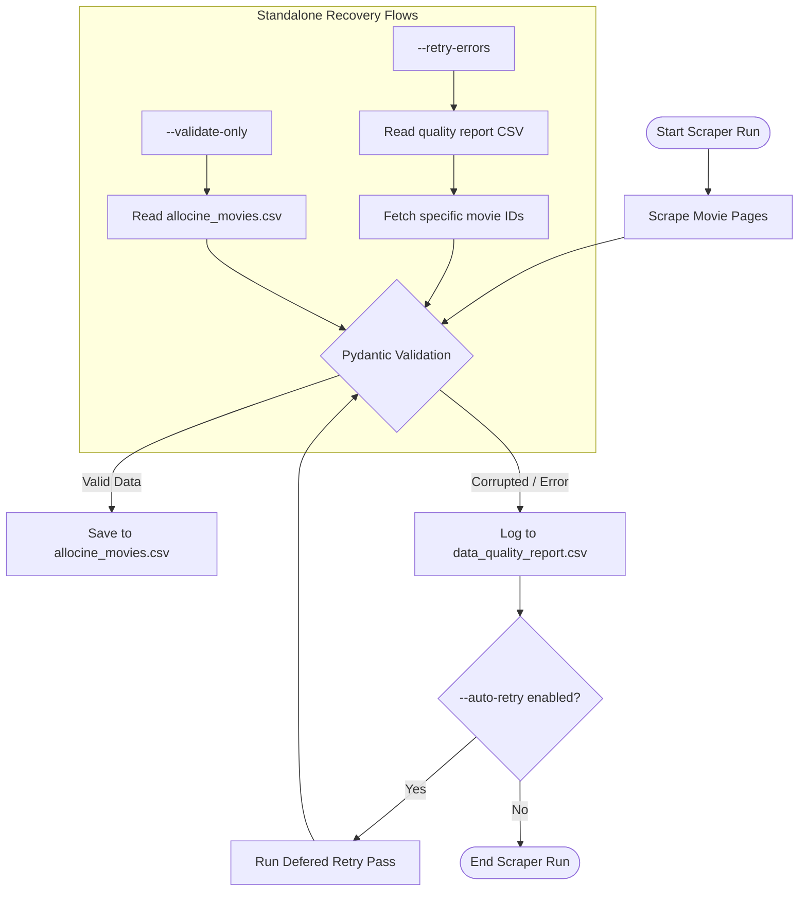

<div align="center">

# 🎬 AlloCine Dataset Scraper

[](https://github.com/ibmw/allocine-dataset-scraper/actions)
[](https://www.python.org/)
[](https://github.com/astral-sh/ruff)
[](https://github.com/microsoft/pyright)
[](https://github.com/ibmw/allocine-dataset-scraper)
[](LICENSE.rst)

**A clean, robust, type-safe, and self-healing CLI scraper for extracting movie datasets from Allociné.fr (the leading French cinema database).**

[Key Features](#-key-features) • [Quick Start](#-quick-start-60s) • [CLI Usage](#-cli-usage) • [Self-Healing Engine](#-data-quality--self-healing) • [Developer Guide](#-development--testing)

</div>

> [!WARNING]
> **Disclaimer:** This project is strictly for **educational and research purposes** (e.g., gathering small datasets for local analysis and academic modeling). Users are responsible for complying with local regulations and respect website terms of service. Do not run high-volume concurrent request loads against Allocine's production servers.

---

## 🌟 Key Features

*   **⚡ Modern Python Tooling:** Powered by `uv` for ultra-fast environment syncing, `pydantic` for strict type-safe parameter validation, and `loguru` for robust log rotation.
*   **🛡️ Self-Healing Data Quality:** Real-time data validation detects corrupted or abnormal fields using Pydantic constraints. Failed pages are stored in a dedicated data quality report for multi-pass recovery.
*   **🔄 Deferred & Standalone Retries:** Supports `--auto-retry` (deletes and retries broken entries at the end of the current run) and `--retry-errors` (a standalone pass that reads the quality report, repairs movies, and merges them back).
*   **📊 Clean CSV Datasets:** Automatic output directory preparation and movie deduplication with smart pagination.
*   **🐳 Containerized Ready:** Secure Docker builds running under non-root users (UID `1000`) for seamless cloud or server deployment.
*   **🧪 100% Code Coverage:** Extensively validated with mocked unit tests (~5s) and unmocked E2E integration tests (~45s) against live Allocine targets.

---

## ⚡ Quick Start (60s)

No cloning required! You can run the scraper directly using `uvx` (or `pipx`):

```bash
# Run the scraper for 5 pages and save to data/allocine_movies.csv
uvx --from git+https://github.com/ibmw/allocine-dataset-scraper.git fetch-allocine --number_of_pages 5

# Check available options
uvx --from git+https://github.com/ibmw/allocine-dataset-scraper.git fetch-allocine --help
```

> [!TIP]
> **Pre-scraped Dataset:** To bootstrap your work without waiting, you can [download a pre-scraped historical dataset](https://huggingface.co/datasets/Olivier/allocine-movies) (June 2026 snapshot) directly.

---

## 📊 Movie Data Fields

The scraper navigates each movie's dedicated page to extract and validate the following rich metadata fields:

| Field | Type | Description |
|:---|:---|:---|
| `id` | `int` | Unique Allocine Movie Identifier (extracted from URL) |
| `title` | `str` | Movie title (in French) |
| `release_date` | `datetime` | Release date (parsed and normalized from French locale) |
| `duration` | `int` | Movie duration in minutes (e.g. `120`) |
| `genres` | `str` | Comma-separated list of genres (up to three) |
| `directors` | `str` | Comma-separated list of movie directors |
| `actors` | `str` | Comma-separated list of main cast members |
| `nationality` | `str` | Country of production |
| `press_rating` | `float` | Average press review score (0.0 to 5.0 stars) |
| `number_of_press_rating` | `float` | Total number of press reviews |
| `spec_rating` | `float` | Average audience review score (0.0 to 5.0 stars) |
| `number_of_spec_rating` | `float` | Total number of audience reviews |
| `summary` | `str` | Movie synopsis (normalized NFKC text) |

---

## 🚀 Installation & Setup

### Local Installation

For developers or advanced users wishing to use the library within a virtual environment:

```bash
# Clone the repository
git clone https://github.com/ibmw/allocine-dataset-scraper.git
cd allocine-dataset-scraper

# Install the library and its CLI globally or in your current env
uv pip install .
# Or using standard pip:
pip install .
```

### Docker Setup

If you want to run isolated containers without installing Python locally:

```bash
# Pull the latest image
docker pull ghcr.io/ibmw/allocine-dataset-scraper:latest

# Prepare local output directory
mkdir -p data

# Run the container (bind-mounting your local data folder)
docker run -v "$PWD/data:/app/data:rw" ghcr.io/ibmw/allocine-dataset-scraper:latest --number_of_pages 10
```

---

## 💻 Usage

### CLI Usage

Once installed, the CLI tool `fetch-allocine` will be available in your system path.

```bash
# General Syntax
fetch-allocine [OPTIONS]
```

#### Common Recipes

*   **Standard Scrape (Default 10 pages):**
    ```bash
    fetch-allocine
    ```

*   **Scrape a Custom Range with custom timing:**
    ```bash
    # Scrape 20 pages starting from page 5, waiting between 3 and 8 seconds per request
    fetch-allocine --number_of_pages 20 --from_page 5 --pause_scraping 3 8
    ```

*   **Append Mode (Incremental update):**
    ```bash
    fetch-allocine --number_of_pages 5 --append_result
    ```

*   **Scrape with Self-Healing Auto-Retry Enabled:**
    ```bash
    # Runs the scrape and automatically triggers a second pass to correct any failures
    fetch-allocine --number_of_pages 10 --auto-retry --max-retries 3
    ```

*   **Repair Past Errors from Quality Report:**
    ```bash
    # Read data/data_quality_report.csv, retry failed movies, and merge repairs back into data/allocine_movies.csv
    fetch-allocine --retry-errors
    ```

*   **Validate an Existing CSV File:**
    ```bash
    # Performs checks on all records inside the CSV without scraping any web pages
    fetch-allocine --validate-only
    ```

#### CLI Reference Options

| Option | Type | Default | Description |
|:---|:---|:---|:---|
| `--number_of_pages` | `INTEGER` | `10` | Total number of Allocine list pages to scrape. |
| `--from_page` | `INTEGER` | `1` | First page number to start scraping from. |
| `--output_dir` | `TEXT` | `data` | Directory where CSV files and reports are saved. |
| `--output_csv_name` | `TEXT` | `allocine_movies.csv` | Filename of the primary scraped movie CSV. |
| `--pause_scraping` | `INT INT` | `2 10` | Min & max seconds to pause between HTTP requests (respects rate limits). |
| `--append_result` | `FLAG` | `False` | Append to the existing CSV instead of overwriting. |
| `--auto-retry` | `FLAG` | `False` | Auto-retry failed or corrupted movie parsing at the end of the run. |
| `--retry-errors` | `FLAG` | `False` | Standalone flow: parse and repair entries from the data quality report. |
| `--max-retries` | `INTEGER` | `3` | Maximum retry attempts recorded for any single corrupted movie. |
| `--validate-only` | `FLAG` | `False` | Run the validation schema on the local CSV without triggering HTTP calls. |
| `--help` | `FLAG` | - | Display CLI help context. |

---

### Python API Usage

You can easily integrate `AllocineScraper` directly into your custom automated Python pipelines:

```python
from pathlib import Path
from allocine_dataset_scraper.config import ScraperConfig, Settings
from allocine_dataset_scraper.scraper import AllocineScraper

# 1. Initialize configuration with Pydantic validation
config = ScraperConfig(
    number_of_pages=5,
    from_page=1,
    output_dir=Path("data"),
    output_csv_name="custom_movies.csv",
    pause_scraping=(3, 8),
    append_result=False,
    auto_retry=True
)

# 2. Optionally load custom system Settings (User-Agent, Log Level, etc.)
settings = Settings(
    log_level="INFO",
    request_timeout=15
)

# 3. Instantiate and run scraper
scraper = AllocineScraper(config, settings=settings)
scraper.scraping_movies()
```

---

## 🛡️ Data Quality & Self-Healing

The scraper incorporates a state-of-the-art self-healing pipeline designed to preserve dataset integrity and automatically repair pages that timed out, encountered captchas, or suffered layout adjustments.



### 1. Boundary & Logical Constraints
Every scraped movie is parsed against `MovieValidationModel` boundaries:
- **`release_date`:** Validates date realism (no dates prior to the birth of cinema in `1880`, nor more than 5 years in the future).
- **`duration`:** Must be positive and under 10 hours (`600` minutes).
- **`press_rating` & `spec_rating`:** Must fall strictly within the `[0.0, 5.0]` star range.
- **`number_of_spec_rating`:** Capped logically to avoid anomalies (`< 500,000` ratings).

### 2. Error Segregation & Logging
Errors are sorted into:
- `SCRAPE_FAILED`: Layout content was missing, blocking page fetches (e.g. rate-limiting, captchas).
- `BAD_DATA`: Fields were parsed but did not conform to the Pydantic type layout constraints.

All errors are isolated in a separate `data_quality_report.csv` file showing exactly which fields were corrupted, along with a `retry_count`.

---

## ⚙️ Environment Configuration

System-wide scraper options are dynamically configured using standard Environment Variables or a local `.env` file. Pydantic loads and parses variables matching the `ALLOCINE_` prefix:

| Env Variable | Type | Default | Description |
|:---|:---|:---|:---|
| `ALLOCINE_BASE_URL` | `str` | `http://www.allocine.fr/films/` | Target scraper listing URL. |
| `ALLOCINE_USER_AGENT` | `str` | `Mozilla/5.0 ...` | HTTP User-Agent header passed to Requests. |
| `ALLOCINE_LOG_LEVEL` | `str` | `INFO` | Logging Verbosity (`DEBUG`, `INFO`, `WARNING`, `ERROR`, `CRITICAL`). |
| `ALLOCINE_REQUEST_TIMEOUT` | `int` | `10` | Network timeout threshold in seconds. |

---

## 🛠️ Development & Testing

### Setting Up the Environment

Ensure you have [uv installed](https://github.com/astral-sh/uv).

```bash
# Clone the repository
git clone https://github.com/ibmw/allocine-dataset-scraper.git
cd allocine-dataset-scraper

# Bootstrap a local virtualenv and synchronize all dev requirements
uv sync --all-extras --dev
```

### Automated Code Quality Checks

Before committing or pushing code changes, verify everything is pristine:

```bash
# Run Ruff lint rules
uv run ruff check .

# Automatically format python files
uv run ruff format .

# Check static typing with Pyright
uv run pyright
```

### Testing Suite

The test suite separates fast mocked unit tests from slow integration E2E tests:

```bash
# 1. Run standard mock-based unit tests (Sleep timers are mocked to no-op, takes ~5s)
uv run pytest

# 2. Run unmocked E2E integration tests against Allocine.fr & verify 100% coverage
uv run pytest --run-e2e --cov=allocine_dataset_scraper --cov-report=term-missing
```

> [!IMPORTANT]
> To protect Allocine's servers and avoid wasting execution time, `time.sleep` is globally mocked to a no-op during regular unit tests in `tests/conftest.py`. Live E2E tests using the `--run-e2e` flag bypass this mocking to perform real HTTP requests and timing delays.

---

## 📝 Contributing

We welcome contributions! Please follow these guidelines:
1. Fork the repo and create your feature branch: `git checkout -b feature/MyFeature`.
2. Keep statement test coverage at **100%** (combining standard mock tests and unmocked E2E integration tests).
3. Ensure type annotations are fully valid under `pyright`.
4. Follow PEP 8 styles (checked and formatted via `ruff`).
5. Open a Pull Request!

---

## 📄 License

This project is licensed under the MIT License - see the [LICENSE.rst](LICENSE.rst) file for details.

## 🙏 Acknowledgments

*   [Allociné.fr](http://www.allocine.fr/) for providing the movie information database.
*   The Python community for providing great libraries like `BeautifulSoup`, `Click`, `Pydantic`, `Ruff`, and `pytest`.